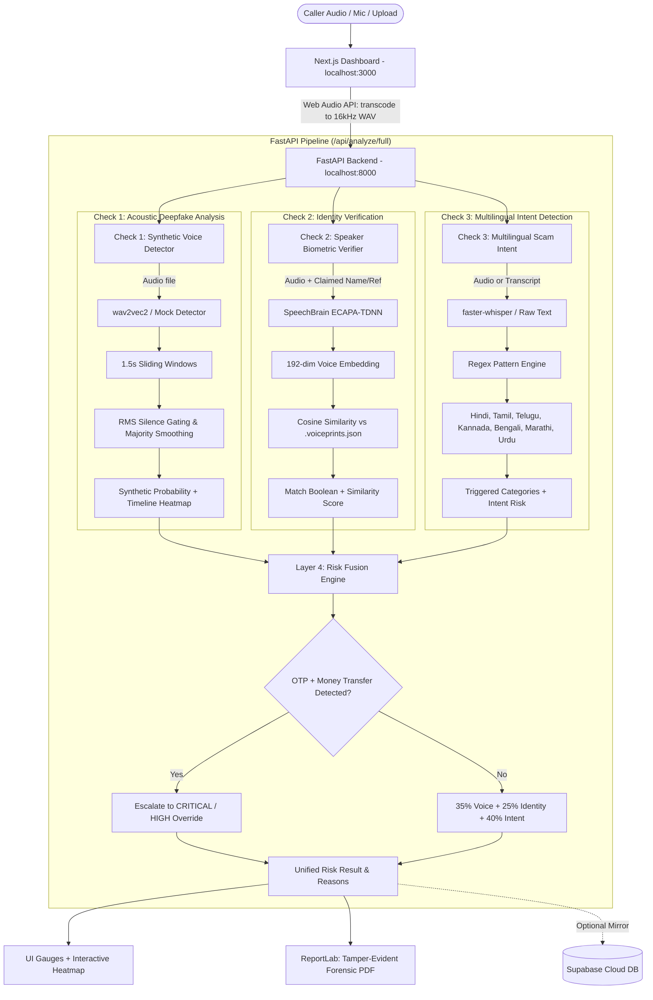

# VoiceGuard AI — System Architecture & Developer Context Document

> **Notice for AI Models & Developers**: This document contains a comprehensive, technical specification of the VoiceGuard AI codebase. It is designed to be fed into any LLM (GPT-4, Claude, Gemini, DeepSeek, etc.) to give the model immediate, complete architectural understanding of the system, data flow, APIs, scoring algorithms, and technical dependencies.

---

## 1. Project Overview & Problem Statement

* **Project Name**: VoiceGuard AI 🛡️
* **Context**: Smart India Hackathon (SIH 2026) · Problem Statement **SIH26104** (AICTE Cyber Security Cell).
* **Domain**: Real-time Voice Deepfake Detection, Caller Impersonation Prevention, Cyber Fraud Forensics.
* **Problem**: Fraudsters use real-time AI voice cloning (using tools like XTTS, ElevenLabs, VALL-E) to clone the voices of family members, bank managers, or police officers, demanding urgent money transfers or OTPs.
* **Core Innovation**: An India-first, explainable, multi-factor defense pipeline. Instead of relying solely on acoustic classifiers (which can fail against clean acoustic replays), VoiceGuard inspects **Voice Authenticity**, **Speaker Identity**, and **Scam Intent** simultaneously, fusing them into an explainable risk verdict with a downloadable forensic PDF.

---

## 2. Technology Stack & Platform Specifications

| Layer | Technologies & Frameworks |
| :--- | :--- |
| **Frontend** | Next.js 16.3.5 (configured with Webpack on Windows), React 19.2.8, Tailwind CSS v4, Web Audio API |
| **Backend API** | Python 3.12, FastAPI 0.141+, Uvicorn (ASGI), Pydantic v2 Settings |
| **Acoustic ML (Check 1)** | Hugging Face Transformers (`AutoModelForAudioClassification`), `wav2vec2` (`motheecreator/Deepfake-audio-detection`), PyTorch 2.13, TorchAudio |
| **Biometrics (Check 2)** | SpeechBrain ECAPA-TDNN (`speechbrain/spkrec-ecapa-voxceleb`), 192-dimensional embeddings, Cosine Similarity |
| **Speech-to-Text & Intent (Check 3)** | `faster-whisper` (CTranslate2 INT8 CPU quantization), Multilingual Regex Pattern Engine |
| **Audio Processing** | `librosa`, `soundfile`, `imageio-ffmpeg` (fallback decoder for WhatsApp `.opus`, `.m4a`, mobile audio) |
| **Forensic Reporting** | ReportLab 5.0+ (Dynamic PDF generation, SHA-256 tamper-evident integrity hashing) |
| **Persistence (Dual)** | Local JSON (`.voiceprints.json`) + Optional cloud mirror (Supabase PostgREST API) |
| **Testing** | Pytest 9.1+, HTTPX (TestClient) |

---

## 3. High-Level Architecture & Data Flow



---

## 4. Repository File Structure & Module Responsibilities

```
voiceguardai/
├── PROJECT_DOCUMENTATION.md      # This file (LLM & Developer reference)
├── BUILD_PLAN.md                 # Development roadmap & phase tracker
├── DEMO.md                       # Presentation script & evaluation guide
├── package.json                  # Next.js scripts & dependencies (uses --webpack)
├── .env.local                    # Frontend config (NEXT_PUBLIC_API_URL)
├── pytest.ini                    # Root Pytest path configuration
│
├── src/                          # Next.js 16 Frontend
│   └── app/
│       ├── layout.jsx            # Root HTML layout & fonts
│       ├── page.jsx              # Main Dashboard (Single Page App)
│       └── globals.css           # Design tokens, gauge animations, equalizer styles
│
├── backend/                      # Python FastAPI Service
│   ├── .env                      # Active runtime config (DETECTOR_ENGINE, models)
│   ├── .env.example              # Environment template
│   ├── pytest.ini                # Backend Pytest config
│   ├── requirements.txt          # Light dependencies (FastAPI, uvicorn, reportlab)
│   ├── requirements-ml.txt       # Heavy ML dependencies (torch, transformers, speechbrain)
│   ├── supabase_schema.sql       # SQL migration for cloud mirroring
│   │
│   ├── app/
│   │   ├── main.py               # FastAPI application, route handlers, middleware
│   │   ├── config.py             # Pydantic BaseSettings (loads .env)
│   │   ├── schemas.py            # Pydantic models for API requests/responses
│   │   ├── audio_utils.py        # 16kHz mono audio loader with ffmpeg fallback
│   │   ├── storage.py            # Best-effort Supabase PostgREST sync
│   │   │
│   │   ├── detectors/            # Check 1: Synthetic Audio Detection
│   │   │   ├── base.py           # Abstract BaseDetector interface
│   │   │   ├── mock_detector.py  # Deterministic hash-based detector (0 dependencies)
│   │   │   ├── wav2vec2_detector.py # Pretrained wav2vec2 + 1.5s sliding window timeline
│   │   │   └── factory.py        # LRU-cached detector provider
│   │   │
│   │   ├── identity/             # Check 2: Biometric Speaker Verification
│   │   │   ├── verifier.py       # SpeechBrain ECAPA-TDNN speaker embedding extraction
│   │   │   └── registry.py       # Local JSON + Supabase voiceprint registry
│   │   │
│   │   ├── intent/               # Check 3: Scam Intent Detection
│   │   │   ├── patterns.py       # Multilingual regex dictionary (Hindi, Hinglish, etc.)
│   │   │   └── analyzer.py       # Intent analyzer + lazy faster-whisper STT
│   │   │
│   │   ├── risk/                 # Layer 4: Explainable Risk Fusion
│   │   │   └── engine.py         # Multi-factor weighting + fraud escalation overrides
│   │   │
│   │   └── report/               # Forensic Evidence Generation
│   │       └── generator.py      # Case metadata (VG-XXXXXXXXXX) + ReportLab PDF renderer
│   │
│   ├── ml/                       # Dataset Preparation & Model Fine-Tuning
│   │   ├── prepare_asvspoof.py   # ASVspoof 2019 dataset parser
│   │   ├── generate_indian_data.py # Synthesizes Indian fakes using edge-tts + Common Voice
│   │   └── train.py              # PyTorch fine-tuning loop for custom wav2vec2
│   │
│   ├── scripts/
│   │   ├── download_dataset.py   # Kaggle dataset downloader
│   │   └── verify_model.py       # Standalone script to verify wav2vec2 loads on GPU/CPU
│   │
│   └── tests/                    # 20 Automated Unit/Integration Tests
│       ├── test_api.py           # Route tests (/health, /analyze/voice, /analyze/full)
│       ├── test_intent.py        # Regex pattern matching unit tests
│       ├── test_report.py        # PDF generation & SHA-256 hashing tests
│       ├── test_risk.py          # Weight fusion & emergency override tests
│       └── test_storage.py       # Supabase mock storage tests
│
└── tools/
    ├── README.md
    └── clone_voice.ipynb         # Google Colab notebook (XTTS-v2) for generating test clones
```

---

## 5. Core Subsystems & Logic

### 5.1 Check 1: Synthetic Voice Detection (`app/detectors/`)
* **Engines Supported**:
  * `mock`: Uses MD5 checksum of audio to deterministically output realistic synthetic probabilities without requiring PyTorch or model downloads.
  * `wav2vec2`: Loads `motheecreator/Deepfake-audio-detection` via Hugging Face.
* **Timeline Slicing Algorithm (`analyze_windows`)**:
  * Chunks input audio into $1.5\text{s}$ windows with $16\text{kHz}$ sampling rate ($24,000$ samples/window).
  * Calculates Root Mean Square (RMS) energy: $\text{RMS} = \sqrt{\frac{1}{N}\sum x_i^2}$. Windows with $\text{RMS} < 0.005$ are flagged as `speech: false` (`quiet`) to prevent false positives during pauses.
  * Majority smoothing filter: Prevents erratic 1-frame spikes by smoothing lone dissenting windows against adjacent speech windows.

### 5.2 Check 2: Speaker Biometric Verification (`app/identity/`)
* **Embedding Model**: `speechbrain/spkrec-ecapa-voxceleb`.
* Produces a 192-dimensional vector.
* **Cosine Similarity**:
  $$\text{Similarity}(A, B) = \frac{A \cdot B}{\|A\| \|B\|}$$
* **Calibration Threshold**: `0.40`. Scores $\ge 0.40$ denote identity match; scores $< 0.40$ flag impersonation mismatch risk ($1.0 - \text{sim}$).

### 5.3 Check 3: Multilingual Scam Intent (`app/intent/`)
* Scans across 5 threat categories:
  1. `otp_request`: Matches "OTP", "verification code", "ओटीपी", "otp batao", "code do".
  2. `money_request`: Matches "UPI", "transfer", "GPay", "PhonePe", "paise", "panam" (Tamil), "dabbulu" (Telugu), "hana" (Kannada), "taka" (Bengali), "kaasu".
  3. `urgency`: Matches "urgent", "immediately", "turant", "jaldi", "abhi", "udane", "ventane", "lavkar", "fauran".
  4. `authority_claim`: Matches "police", "customs", "CBI", "income tax", "bank manager", "अधिकारी".
  5. `secrecy`: Matches "don't tell", "secret", "kisi ko mat batana", "confidential".
* **Base Risk Calculation**: $\text{Risk} = \min(1.0, 0.28 \times N_{\text{triggered}})$. If both OTP and Money are requested, $+0.20$ is added.

### 5.4 Layer 4: Explainable Risk Fusion (`app/risk/engine.py`)
* **Default Weighting**: Voice ($35\%$), Identity ($25\%$), Intent ($40\%$).
* **Redistribution**: If identity check is skipped (no reference audio), weights are dynamically normalized over available signals.
* **Emergency Override (Fraud Prevention Rule)**:
  ```python
  if "otp_request" in intent.triggered and "money_request" in intent.triggered:
      # OTP + Money request is NEVER genuine in an inbound call
      tier = "critical" if ({"urgency", "authority_claim", "secrecy"} & set(intent.triggered)) else "high"
      overall_risk = max(overall_risk, 0.85 if tier == "critical" else 0.70)
  ```

---

## 6. REST API Specification

### `GET /health`
* **Response**: `{"status": "ok", "engine": "mock" | "wav2vec2"}`

### `POST /api/analyze/full`
* **Content-Type**: `multipart/form-data`
* **Parameters**:
  * `audio`: Binary audio file (`.wav`, `.mp3`, `.m4a`, `.opus`) (Optional if transcript provided)
  * `transcript`: String text (Optional if audio provided)
  * `reference_audio`: Binary audio of genuine person (Optional)
  * `claimed_identity`: String name in registry (Optional)
* **Response (JSON)**:
```json
{
  "case_id": "VG-2E6CB09A3D",
  "created_at": "2026-09-19T04:30:00+00:00",
  "audio_sha256": "e3b0c44298fc1c149afbf4c8996fb92427ae41e4649b934ca495991b7852b855",
  "voice": {
    "is_synthetic": true,
    "synthetic_probability": 0.892,
    "label": "synthetic",
    "confidence": 0.784,
    "segments": [
      {"start": 0.0, "end": 1.5, "is_synthetic": false, "speech": true, "synthetic_probability": 0.12},
      {"start": 1.5, "end": 3.0, "is_synthetic": true, "speech": true, "synthetic_probability": 0.94}
    ],
    "speech_windows": 2,
    "synthetic_fraction": 0.5
  },
  "identity": {
    "checked": true,
    "similarity": 0.281,
    "identity_match": false,
    "mismatch_risk": 0.719,
    "source": "registry"
  },
  "intent": {
    "transcript": "Sir main bank se bol raha hoon, turant OTP batao aur paise transfer karo",
    "triggered": ["authority_claim", "urgency", "otp_request", "money_request"],
    "intent_risk": 1.0,
    "matches": {
      "otp_request": "OTP batao",
      "money_request": "paise transfer"
    }
  },
  "risk": {
    "overall_risk": 0.885,
    "tier": "critical",
    "response": "Block and force step-up verification before any action.",
    "reasons": [
      "Voice sounds AI-synthetic (~89% fake).",
      "Voice does NOT match the claimed person's voiceprint.",
      "Suspicious request detected: authority_claim, urgency, otp_request, money_request.",
      "Escalated: caller asked for OTP + money together — classic fraud pattern."
    ]
  }
}
```

### `POST /api/report/pdf`
* Takes the exact same form fields as `/api/analyze/full`.
* Returns `application/pdf` binary stream with header `Content-Disposition: attachment; filename="VG-XXXXXXXXXX.pdf"`.

### `POST /api/voices/register`
* Enrolls a speaker embedding into `.voiceprints.json`.
* **Form fields**: `name` (string), `audio` (file).

---

## 7. Configuration & Environment Reference

### `backend/.env`
```env
# "mock" for light, zero-ML instant demo; "wav2vec2" for heavy PyTorch classifier
DETECTOR_ENGINE=mock

# Pretrained Hugging Face audio model
WAV2VEC2_MODEL=motheecreator/Deepfake-audio-detection

# Optional Supabase mirror (leave empty for 100% offline local storage)
SUPABASE_URL=
SUPABASE_KEY=
```

### `.env.local` (Frontend)
```env
NEXT_PUBLIC_API_URL=http://127.0.0.1:8000
```

---

## 8. Operating Guide for AI Models & Developers

### Starting the Backend (FastAPI):
```powershell
cd backend
python -m uvicorn app.main:app --host 127.0.0.1 --port 8000 --reload
```

### Starting the Frontend (Next.js):
> **Crucial Note**: Next.js 16 defaults to Turbopack which fails on some Windows environments without native SWC build tools. Always use Webpack (`next dev --webpack` is mapped to `npm run dev`).
```powershell
npm run dev
```

### Running the Test Suite:
```powershell
python -m pytest
```
*Expected Result*: **20 passed** across API, intent, risk, report generation, and storage.

---

## 9. Architectural Design Choices & Edge Handling

1. **Why Pure-Python Intent Defaults**:
   Speech recognition models (Whisper) are heavy (~1-2GB). The intent regex engine runs in pure Python with zero external libraries, allowing immediate code-mixed Hindi scam detection even on low-spec hardware.
2. **Why Windows Path Handling Matters**:
   SpeechBrain has a known Windows issue where absolute paths (e.g. `C:\...`) are parsed as URL schemes. VoiceGuard wraps audio loading through `load_wav16k` in [`audio_utils.py`](file:///c:/Users/HP/Ibrahim/Desktop/BACKUP/WEB%20DEVELOPMENT/SIH/voiceguardai/backend/app/audio_utils.py), bypassing the SpeechBrain internal loader and feeding in-memory float tensors.
3. **Dual Storage Philosophy**:
   Cloud database failure must never cause a call to go uninspected. Supabase calls are wrapped in non-blocking try-catch blocks with low timeouts ($5\text{s}$). The local JSON registry is always the primary source of truth.
